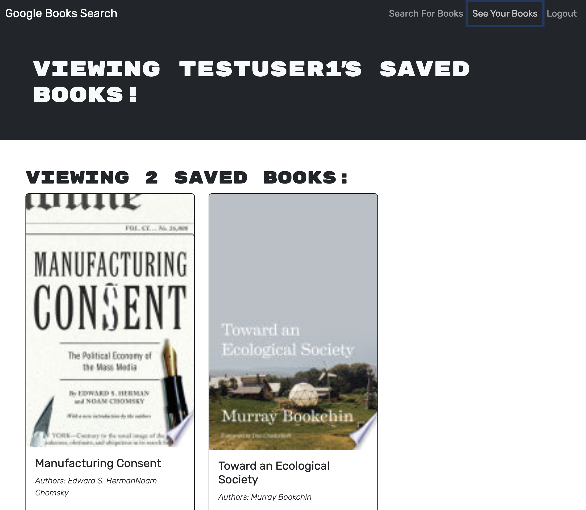

# Book Search Engine

## Description

This project was an exercise in refactoring an existing RESTful API application to instead use a GraphQL API. The application uses TypeScript, Express, Mongoose, GraphQL, Apollo, JSONWebToken, bcrypt, and React. 

## Usage

Users can create an account, search for books using Google Books API, save books to their account, and delete books from their account. See the deployed application here: [Book Search Engine](https://book-search-engine-0tw8.onrender.com/)

## License

This repository uses an [MIT License ↗️](./LICENSE.txt).
